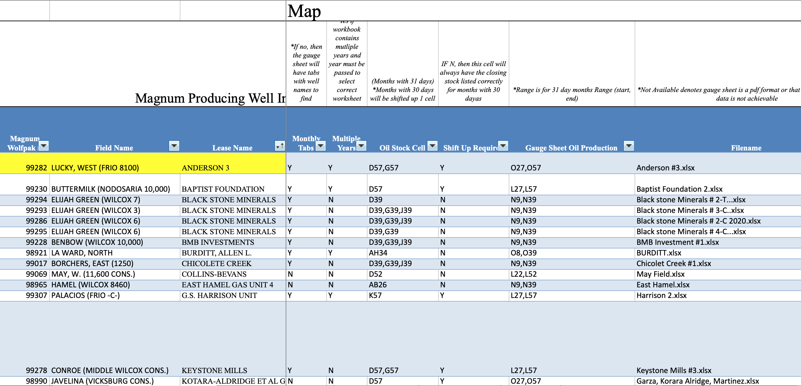
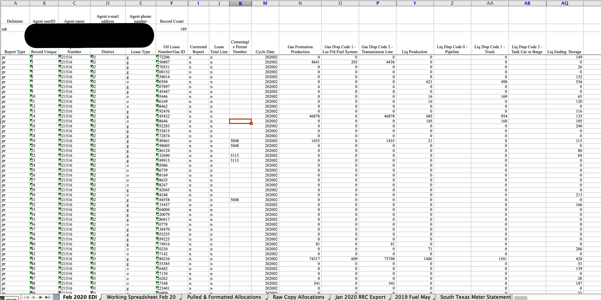
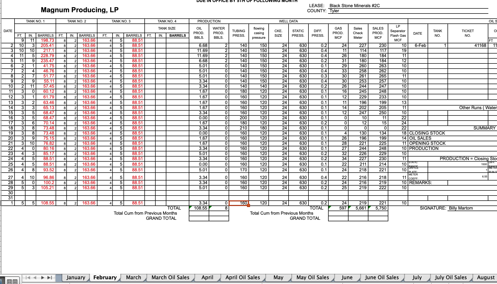
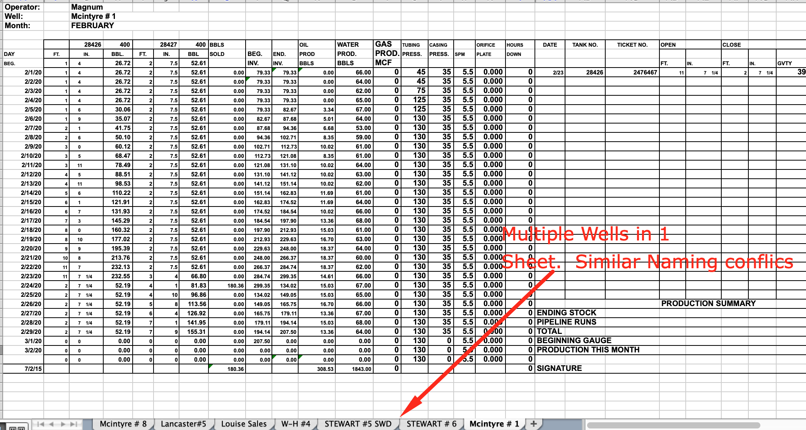

# Production Reporting RRC - Data Extraction & EDI Preparation

# Brief Overview

1. This project will expedite the process of reporting oil and gas volumes to the Texas oil and gas commission (RRC).

2. Using Python, the project will loop through Excel files holding production data for each well in the company and extract the desired data for reporting.

3.  The data will be loaded intoto an EDI Excel template accepted by the RRC for efficient, batch uploads to the commission

# Technical Challenges of Project
1.  Handle non-standardized file names by using partial matches
2.  Create dictionary/map for pulling files & values due to non-standardized/varying formats of source data Excel sheets

3.  Create program and processes to handle different formats of Excel workbooks

# Images/Screenshots

## Source Data, Excel EDI & Extracted Data

1.  Data Map for Pulling Data by Well

2.  EDI for Submission

3.  Examples of Source Data Excel Sheets
* Multiple Months

* Multiple Wells per Workbook

4. Final Pandas DataFrame Storing Extracted Data to be Reported Loaded Into EDI Sheet.

# Additional & Full Length Overview

This python program is designed to open non-standardized .xlsx 
files and pull data certain values for efficient Texas RRC Production Reporting.
In order for the program to work, internal gauge sheets (data source) 
must first be converted from xls to xlsx using a macro excel sheet - convertxls.xslm
(Company is still using old microsoft 1997-2003 .xls files)
Once the files are converted, this will allow openpyxl to function correctly.

Since the data source files for extraction are non-standardized, keys 
had to be generated manually, to tell the program where to find the data.
The keys/legend is stored in the Data Map spreadsheet.
This Data Map spreadsheet is then stored as a Pandas DataFrame.

Also, due to the company's lean and unorganized structure, the source data filenames
may have to literally be passed.  However, the program will attempt to match and find the
source file based on well name search within the source file directory. The program should 
fully execute and not break upon not being able to find a well's gauge sheet (data source)

At the end, a dataframe will be created to view pulled values, file names pulled
for data qualty assurance.
These extracted values will then be pasted into the reporting spreadsheet, and 
also verified for accuracy based on additional calculations and factors
